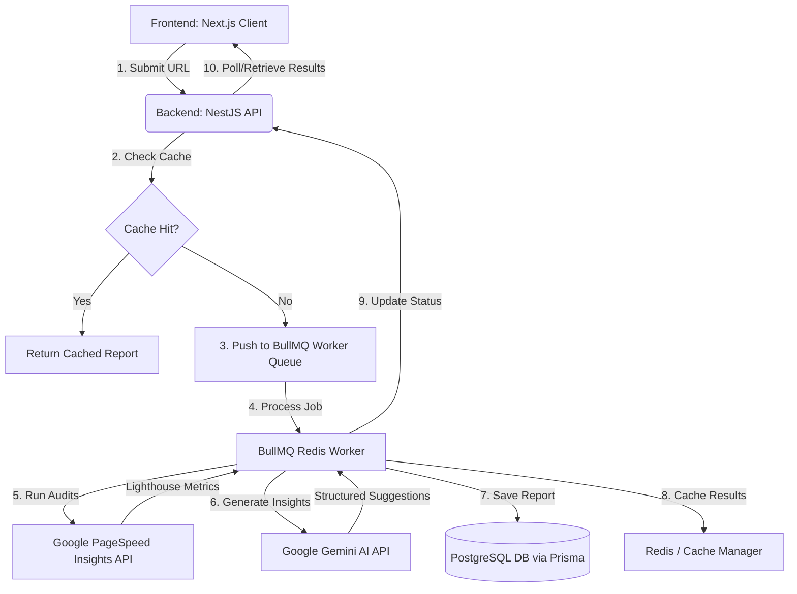

# 🚀 SEO Health Scanner

An AI-powered, professional SEO auditing application featuring a bold **Neo-Brutalist** design. The application runs instant website analysis, evaluates performance benchmarks (Core Web Vitals), checks accessibility and SEO best practices, and delivers custom, human-like optimization steps generated by **Google Gemini AI**.

---

## 🏗️ System Architecture

The project is structured as a monorepo consisting of a separate frontend and backend application. Below is a high-level data flow diagram of how a scan request is processed:



---

## ⚡ Core Features

- **Automated Performance Audits:** Measures Core Web Vitals (First Contentful Paint, Largest Contentful Paint, Total Blocking Time, Cumulative Layout Shift, and Time to Interactive) using Google Lighthouse.
- **Competitor SEO Comparison (costs 2 credits):** Allows users to compare their site directly with a competitor side-by-side. Performs concurrent Lighthouse audits, maps scores to overlapping radar charts, and generates a structured Gemini AI executive briefing comparing strengths, weaknesses, and a recommended action plan.
- **AI-Powered SEO Consultant:** Analyzes raw metrics and failed SEO audits using the Google Gemini API (`gemini-flash-latest`) to generate structured, actionable, and user-friendly recommendations.
- **Server-Side PDF Exporter (Puppeteer):** Generates high-quality A4 PDF reports on the server using a headless browser session. It artificially injects the user's JWT authorization cookie to bypass security gates, disables visual animations, strips brutalist slants/gradient backgrounds, and flattens all tab details for a clean corporate/office report. **Optimized with a conditional animation toggle (`?export=true`): live web app users enjoy smooth chart animations, while the PDF renderer disables them (`isAnimationActive={!isExportMode}`) and waits for the chart container (`.recharts-wrapper`/`.recharts-surface`) to mount, capturing a fully-drawn static snapshot of the radar chart.**
- **Asynchronous Queue Management:** Relies on **BullMQ** and **Redis** to offload long-running Lighthouse API calls to background workers, avoiding gateway timeouts.
- **Optimized Caching:** Caches compiled SEO reports in-memory (or via Redis) for 24 hours to prevent redundant expensive API hits for identical URLs.
- **Secure Authentication:** Features local email/password sign-up/login (using `bcrypt` and `passport-jwt`) along with sessionless **Google OAuth 2.0** integration (configured with `state: false` for stateless cookie authentication).
- **Freemium & Multi-Tier Monetization:** Grants new users 3 free scans. Deducts 1 credit on Cache Misses for single scans and 2 credits for competitor comparisons (Cache Hits remain free). Integrates Razorpay Standard Checkout for purchasing Starter (5 scans), Pro (12 scans), and Agency (35 scans) bundles. **Guaranteed billing idempotency via transaction logging and atomic database updates to prevent double-provisioning, with an automated refund system that returns credits instantly if a scan or comparison job fails (e.g., due to competitor website timeouts).**
- **Scan History Dashboard:** Displays interactive user history tables, scan statuses (`PENDING`, `PROCESSING`, `COMPLETED`, `FAILED`), and direct links to comprehensive reports.
- **Robust API Error Handling:** Leverages a custom `ApiError` class extending the native JS `Error` object to maintain exact stack traces and prevent empty object logging (`{}`) in Next.js development tools. The frontend Axios interceptor extracts and passes specific, user-friendly exception messages sent by the NestJS backend (such as credit constraints or validation lists) directly to React Query UI elements and toast notifications.
- **Dynamic Brutalist & Responsive UI/UX:** Built with a premium **Neo-Brutalist** aesthetic featuring custom HSL colors, thick black borders, off-axis offset shadows, and smooth page transition animations (using Framer Motion). Leverages micro-interactions like interactive hover rotation effects, dynamic loading spinner states, live analyzer retry trackers, rate-limiting warnings, and clear toast notifications (via `sonner`) to keep the user informed.
- **Skeleton Loading & Perceived Performance:** Pre-renders a background structural preview of the final report layout using pulsing card skeletons with staggered CSS animation delays. This is coupled with a foreground active progress overlay that cycles through 9 detailed scan-stage messages, preventing layout flash on fast cache hits and boosting perceived system speed.


---

## 🛠️ Technology Stack

### Frontend
- **Framework:** [Next.js 15](https://nextjs.org/) (App Router)
- **Styling:** [Tailwind CSS](https://tailwindcss.com/) with custom **Neo-Brutalist styling** (thick borders, offset box shadows, high-contrast typography, and bold flat colors)
- **State Management & Fetching:** [@tanstack/react-query](https://tanstack.com/query/latest) (React Query)
- **Icons:** [Lucide React](https://lucide.dev/)
- **Testing:** [Jest](https://jestjs.io/) & [React Testing Library](https://testing-library.com/docs/react-testing-library/intro/)

### Backend
- **Framework:** [NestJS](https://nestjs.com/) (TypeScript)
- **Database ORM:** [Prisma ORM](https://www.prisma.io/)
- **Database Engine:** [PostgreSQL](https://www.postgresql.org/)
- **PDF Generation:** [Puppeteer](https://pptr.dev/) (headless Chrome automation)
- **Background Jobs:** [BullMQ](https://docs.bullmq.io/) with [Redis](https://redis.io/)
- **AI Engine:** [@google/generative-ai](https://www.npmjs.com/package/@google/generative-ai) (Google Gemini)
- **Authentication:** Passport.js (`passport-google-oauth20`, `passport-jwt`, cookies, and JWT token signatures)

---

## 🚀 Getting Started

### Prerequisites

Ensure you have the following installed on your machine:
- **Node.js** (v18.x or higher)
- **npm** (v9.x or higher) or **yarn** / **pnpm**
- **PostgreSQL** running instance
- **Redis** running instance (required for BullMQ queue processing)

---

### Step 1: Clone and Install Dependencies

Clone this repository and install package dependencies for both components:

```bash
# Clone the repository
git clone <repository-url>
cd seo-health-scanner

# Install backend dependencies
cd backend
npm install

# Install frontend dependencies
cd ../frontend
npm install
```

---

### Step 2: Configure Environment Variables

Create the respective configuration files in each directory:

#### 1. Backend Configuration
Create a `.env` file in the `backend/` directory:

```env
# Database connection (PostgreSQL)
DATABASE_URL="postgresql://<username>:<password>@localhost:5432/<database_name>"

# Redis connection url (Used for BullMQ)
# NOTE: Avoid using cloud-hosted instances with IP restrictions (like Render Redis) for local development.
# Use a local Redis instance to prevent "Client IP address is not in the allowlist" connection failures.
REDIS_URL="redis://localhost:6379"

# JWT Token Secret
JWT_SECRET="generate-a-long-random-string-here"

# Google PageSpeed Insights API Key
# Obtain one from Google Cloud Console: https://developers.google.com/speed/docs/insights/v5/get-started
GOOGLE_API_KEY="your-google-pagespeed-api-key"

# Google Gemini API Key
# Obtain one from Google AI Studio: https://aistudio.google.com/
GEMINI_API_KEY="your-gemini-api-key"

# Frontend Application Origin (For CORS and redirects)
FRONTEND_URL="http://localhost:3000"

# Google OAuth 2.0 Credentials (For Google Social Sign-In)
GOOGLE_CLIENT_ID="your-google-client-id"
GOOGLE_CLIENT_SECRET="your-google-client-secret"
GOOGLE_CALLBACK_URL="http://localhost:3001/auth/google/callback"

# Razorpay Credentials (For Credits Purchase)
# Obtain from Razorpay Dashboard > Settings > API Keys & Webhooks
RAZORPAY_KEY_ID="your-razorpay-key-id"
RAZORPAY_KEY_SECRET="your-razorpay-key-secret"
RAZORPAY_WEBHOOK_SECRET="your-custom-webhook-secret-phrase"
```

#### 2. Frontend Configuration
Create a `.env.local` file in the `frontend/` directory:

```env
NEXT_PUBLIC_API_URL="http://localhost:3001"
NEXT_PUBLIC_RAZORPAY_KEY_ID="your-razorpay-key-id"
```

---

### Step 3: Database Setup (Prisma)

Navigate to the `backend/` directory and run database migrations to create the tables in PostgreSQL and generate the Prisma Client:

```bash
cd backend

# Run migrations
npx prisma migrate dev --name init

# Generate Prisma Client
npx prisma generate
```

#### 💡 Managing Credits for Local Testing

By default, new users are created with **3 free credits**. If you run out of credits during local testing:
1. Run **Prisma Studio** in your terminal inside the `backend/` directory:
   ```bash
   npx prisma studio
   ```
2. Navigate to the **User** model and manually update the `credits` field of your user account to the desired number.


---

### Step 4: Run the Application

You need to run both the backend and frontend servers.

#### Start the Backend Server (NestJS)
```bash
cd backend
npm run start:dev
```
The NestJS API will start running on [http://localhost:3001](http://localhost:3001).

#### Start the Frontend Server (Next.js)
```bash
cd frontend
npm run dev
```
The Next.js client will start running on [http://localhost:3000](http://localhost:3000).

---

### Step 5: IDE Integration (Optional)

A `.vscode/settings.json` file is configured at the workspace root to automatically suppress VS Code's built-in CSS warnings for Tailwind CSS v4 custom directives (like `@theme`, `@utility`, and `@apply`) by setting `"css.lint.unknownAtRules": "ignore"`. This provides a clean editor experience when working on standard CSS files.

---

## 📊 Database Schema Details

The PostgreSQL database (managed via Prisma) has four main entities:

1. **User:** Tracks registered users (both `local` email/password accounts and `google` authenticated users).
2. **Scan:** Tracks initiated website scans, storing URL, request timestamp, ownership, and background queue status (`PENDING`, `PROCESSING`, `COMPLETED`, `FAILED`).
3. **Report:** Contains detailed score counts (Performance, Accessibility, Best Practices, SEO), the raw JSON data from Lighthouse, and structured recommendation objects returned by Gemini AI.
4. **Transaction:** Logs completed credit purchases uniquely by Razorpay order ID to guarantee payment idempotency.

Refer to the [Prisma Schema](file:///d:/Projects/seo-health-scanner/backend/prisma/schema.prisma) for exact types and relations.

---

## 🧪 Running Tests

Both frontend and backend contain test suites to verify functionality:

### Backend Testing (NestJS)
```bash
cd backend

# Unit tests
npm run test

# End-to-End (e2e) tests
npm run test:e2e

# Test coverage
npm run test:cov
```

### Frontend Testing (Next.js)
```bash
cd frontend

# Unit & component tests (Jest)
npm run test

# Watch mode
npm run test:watch
```

---

## ⚙️ Technical Highlights

### 1. Puppeteer + Recharts PDF Export Integration

During PDF generation, rendering interactive SVG charts (like Recharts) in a headless browser (Puppeteer) presents two common challenges:
- **Dynamic Chunks & Race Conditions**: The radar chart component is dynamically loaded with `ssr: false` to optimize bundle size, causing it to render asynchronously. Standard page-loading listeners like `networkidle` do not guarantee the chart chunk has finished downloading and mounting.
- **Animation Freeze**: Recharts animates data points on load. Injected PDF print CSS (`animation: none !important`) freezes these transition frames at the start state (scale `0` / opacity `0`), rendering blank charts.

**The Solution:**
1. **Conditional Export Mode**: The backend Puppeteer worker appends `?export=true` to the URL.
2. **Dynamic Animation Toggle**: The frontend `<SeoRadarChart />` checks `window.location.search` and dynamically sets `isAnimationActive={!isExportMode}`. Normal users get smooth entry animations, while Puppeteer gets an instantly rendered static chart.
3. **DOM Waiting**: The backend waits for both the main report metrics (`OVERALL SCORE`) and the chart SVG (`.recharts-wrapper`/`.recharts-surface`) to fully mount before building the PDF.

### 2. Symmetric Competitor Comparison Caching & Dual Radar Chart

Comparing two websites requires concurrent audits, doubling the execution time and backend resource usage. To make this performant and prevent double-charging users for identical comparisons, we designed:

- **Symmetric Redis Caching**: When comparing `Site A` vs `Site B`, we sort the URLs alphabetically to build the cache key (e.g. `compare:adidas.com:nike.com`). Therefore, running `adidas.com` vs `nike.com` or `nike.com` vs `adidas.com` resolves to the exact same cache record. Cache hits return instantly and cost **0 credits** instead of 2.
- **Concurrent Auditing**: The BullMQ background worker uses `Promise.all` to fetch PageSpeed Insights for both the target and competitor URLs concurrently, speeding up execution and returning results faster.
- **Overlapping Dual Radar Chart**: A custom `<DualRadarChart />` is used to draw both scores on the same polar plane. The primary site is highlighted in solid green (`#00C853`, `fillOpacity={0.6}`), while the competitor uses a red, semi-transparent dashed polygon (`#FF5757`, `fillOpacity={0.3}`, `strokeDasharray="5 5"`), making it clear who wins in each metric category.
- **Dedicated Route / UI Split**: Instead of complicating the single-site audit `/results/[id]` path, comparison scans route to `/compare/[id]`, rendering side-by-side matrices (winner-highlighted tables), dual charts, and a structured Gemini AI briefing section (strengths, weaknesses, and a comparison action plan).

---


## 📄 Deployment (Render setup)

When deploying to Render:
1. **Database Migration**: Ensure the Render backend service uses this **Build Command** to automatically apply Prisma migrations:
   ```bash
   npm run build && npx prisma migrate deploy
   ```
2. **Razorpay Webhooks**: Configure a webhook inside your Razorpay Dashboard pointing to:
   `https://your-backend-api.onrender.com/billing/webhook`
   Subscribe to the `payment.captured` and `order.paid` events.
3. **Environment Settings**: Add the environment variables defined in the `.env` template to the Render settings.

## 📄 License

This project is licensed under the MIT License.
